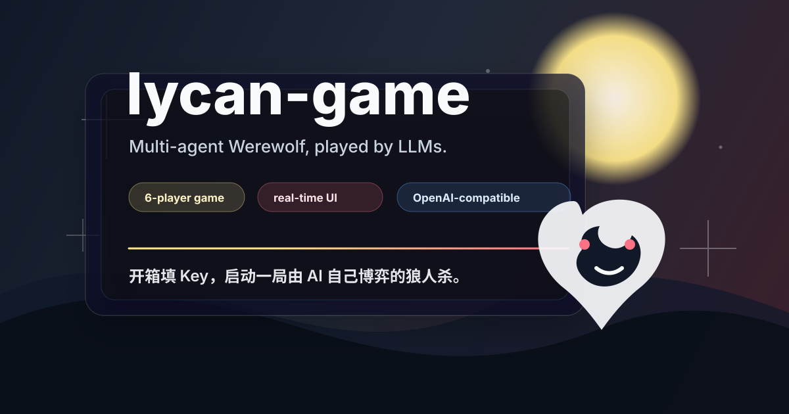

<p align="center">
  
</p>

<h1 align="center">lycan-game</h1>

<p align="center">
  <strong>AI 驱动的 6 人狼人杀。</strong>
  <br />
  配好模型 API Key 后，启动后端和前端即可开局观察多个 LLM 玩家对局。
</p>

<p align="center">
  <a href="#快速启动"></a>
  <a href="#源码运行"></a>
  <a href="#验证流程"></a>
  <a href="#隐私说明"></a>
</p>

<p align="center">
  <a href="#快速启动">快速启动</a>
  ·
  <a href="#源码运行">源码运行</a>
  ·
  <a href="#模型配置">模型配置</a>
  ·
  <a href="#验证流程">验证流程</a>
  ·
  <a href="#打包-release">打包 Release</a>
</p>

## 项目简介

lycan-game 是一个 6 人 AI 狼人杀项目。后端负责游戏规则、角色信息隔离、模型调用和 WebSocket 状态推送；前端负责展示玩家、发言、夜晚行动、投票和游戏事件。

默认玩法是 6 人局：

| 阵营 | 角色 | 人数 |
| --- | --- | --- |
| 狼人阵营 | 狼人 | 2 |
| 好人阵营 | 预言家 | 1 |
| 好人阵营 | 女巫 | 1 |
| 好人阵营 | 平民 | 2 |

## 快速启动

如果只是想玩，优先使用 Release 包。Release 包不需要安装 Python 或 Node.js。

1. 打开 GitHub Releases 页面。
2. 下载 `lycan-game-windows.zip`。
3. 解压压缩包。
4. 双击 `start.bat`。
5. 按终端提示填写 API Key。
6. 浏览器打开 `http://localhost:8000`。

Release 包里的常用文件：

| 文件 | 用途 |
| --- | --- |
| `start.bat` | 配置并启动游戏 |
| `configure.bat` | 重新填写 API Key |
| `ping_model.bat` | 快速测试模型厂商是否能连通 |
| `lycan-game.exe` | 后端服务和静态前端入口 |

## 给 AI 助手的执行要求

如果你是 AI 助手，按下面顺序操作：

1. 优先找 Release 包并使用 `lycan-game-windows.zip`。
2. 如果没有 Release 包，再走源码运行。
3. 需要 API Key 时，在用户本机终端里让用户输入。
4. 不要让用户把 API Key 发到聊天窗口。
5. 先执行验证流程，再让用户开正式游戏。
6. 连通性测试只需要按厂商/base_url 去重测试一次，不要跑完整游戏来测试连通性。

更短的 AI 操作说明也在 [AI_QUICKSTART.md](AI_QUICKSTART.md)。

## 源码运行

源码模式需要：

- Python 3.11+
- Node.js 18+
- 至少一个 OpenAI-compatible 模型 API Key

### 1. 克隆仓库

```powershell
git clone <repo-url>
cd lycan-game
```

### 2. 安装后端依赖

```powershell
python -m venv backend/.venv
backend\.venv\Scripts\python.exe -m pip install -r backend\requirements.txt
```

### 3. 配置模型

推荐使用交互式配置向导：

```powershell
python scripts\configure_players.py
```

也可以复制模板后手动编辑：

```powershell
Copy-Item backend\config\players.example.json backend\config\players.json
```

然后编辑：

```text
backend/config/players.json
```

### 4. 验证模型连通性

```powershell
python scripts\ping_model.py --timeout 20
```

这个命令只做低成本连通性测试：

- 默认按 `(provider, base_url)` 去重。
- 同一家厂商只测一个代表座位。
- 不打印 API Key。
- 不跑完整游戏。

只测某个座位：

```powershell
python scripts\ping_model.py --seat 3 --timeout 20
```

### 5. 启动后端

```powershell
cd backend
.\.venv\Scripts\python.exe main.py
```

后端默认地址：

```text
http://localhost:8000
```

如果前端已经构建过，直接打开这个地址即可。

### 6. 启动前端开发服务器

另开一个终端：

```powershell
cd frontend
npm install
npm run dev
```

前端开发地址：

```text
http://localhost:5173
```

## 模型配置

真实配置文件：

```text
backend/config/players.json
```

配置示例：

```json
{
  "players": [
    {
      "seat_id": 1,
      "player_name": "小明",
      "model_name": "deepseek-chat",
      "provider": "openai",
      "api_key": "sk-your-key",
      "base_url": "https://api.deepseek.com/v1"
    }
  ]
}
```

目前主要使用 `provider: "openai"` 接入 OpenAI-compatible 服务。常见需要改的字段：

| 字段 | 说明 |
| --- | --- |
| `model_name` | 厂商提供的模型名 |
| `api_key` | 你的模型 API Key |
| `base_url` | 厂商的 OpenAI-compatible API 地址 |

可参考模板：

- [backend/config/players.example.json](backend/config/players.example.json)
- [backend/config/players.deepseek-minimax-mimo.example.json](backend/config/players.deepseek-minimax-mimo.example.json)
- [backend/config/players.volcengine.example.json](backend/config/players.volcengine.example.json)
- [backend/config/players.volcengine-coding-plan.example.json](backend/config/players.volcengine-coding-plan.example.json)

## 验证流程

源码模式建议按这个顺序验证：

1. 检查 Python 代码能正常编译：

```powershell
python -m compileall backend scripts
```

2. 检查模型厂商能连通：

```powershell
python scripts\ping_model.py --timeout 20
```

3. 启动后端后检查健康接口：

```powershell
curl http://localhost:8000/health
```

4. 打开前端页面，创建或启动一局游戏。

如果只是确认模型 Key 是否可用，不要直接跑完整游戏。完整游戏会产生多轮模型调用，消耗明显更多 token。

## 常见问题

### 提示 players.json 配置未完成

重新运行配置向导：

```powershell
python scripts\configure_players.py
```

### 模型 ping 失败

先检查：

- `api_key` 是否属于对应厂商。
- `base_url` 是否正确。
- `model_name` 是否是账号可用模型。
- 当前网络是否能访问该厂商 API。

### HTTP 成功但 content 为空

如果 `finish_reason=length`，通常是 thinking 模型输出 token 太低导致。默认 ping 已经使用 `128` 输出 token；仍失败时可以提高：

```powershell
python scripts\ping_model.py --timeout 20 --max-tokens 256
```

### 端口被占用

后端默认使用 `8000`，前端默认使用 `5173`。如果端口被占用，先关闭已有进程后重启。

## 打包 Release

在 Windows 上执行：

```powershell
.\scripts\build_windows_release.ps1
```

成功后会生成：

```text
release/lycan-game-windows.zip
```

这个包适合分享给不会配置开发环境的玩家。

## API

| 方法 | 路径 | 说明 |
| --- | --- | --- |
| `POST` | `/game/start` | 使用本地 `players.json` 创建并启动游戏 |
| `POST` | `/game/create` | 通过请求体自定义玩家配置创建游戏 |
| `POST` | `/game/{id}/start` | 启动已创建的游戏 |
| `POST` | `/game/{id}/continue` | 推进交互式游戏 |
| `GET` | `/game/{id}/status` | 获取游戏状态 |
| `GET` | `/games` | 列出活跃游戏 |
| `GET` | `/game/config` | 获取玩家配置，API Key 会被隐藏 |
| `GET` | `/models/presets` | 获取预设模型列表 |
| `GET` | `/health` | 健康检查 |
| `WS` | `/game/{id}/ws` | 实时推送游戏状态 |

## 项目结构

```text
sand-box/
├── backend/
│   ├── api/                    # REST API 与 WebSocket 路由
│   ├── config/                 # 游戏配置与玩家模板
│   ├── game/                   # 游戏引擎、状态、角色、LLM 适配器
│   ├── main.py                 # FastAPI 入口
│   └── model_ping.py           # 轻量模型连通性测试
├── frontend/
│   └── src/                    # React 前端
├── scripts/
│   ├── configure_players.py    # 交互式配置向导
│   ├── ping_model.py           # 命令行 ping 包装
│   └── build_windows_release.ps1
├── tests/                      # 后端测试
├── docs/                       # 文档和 README 封面
└── AI_QUICKSTART.md            # 给 AI 助手的启动说明
```

## 隐私说明

- `backend/config/players.json` 已被 `.gitignore` 忽略。
- `backend/config/players.json.bak` 等本地备份也会被忽略。
- 不要把 API Key 发到聊天窗口。
- 分享 Release 包时，不要把自己填过 Key 的 `config/players.json` 一起发出去。

## License

未指定。正式公开分发前建议补充 License。
